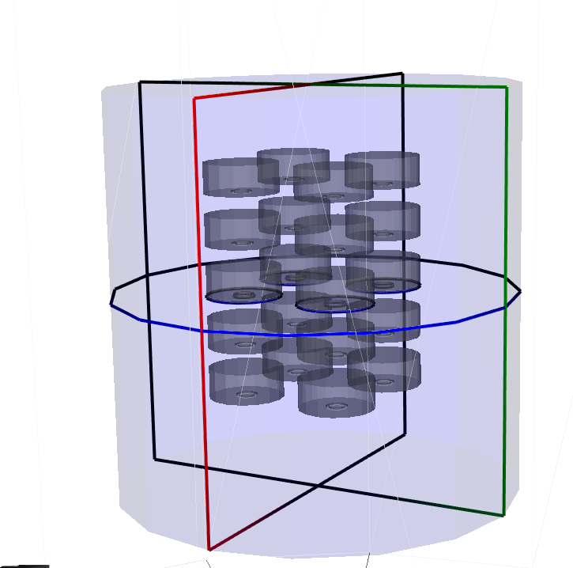
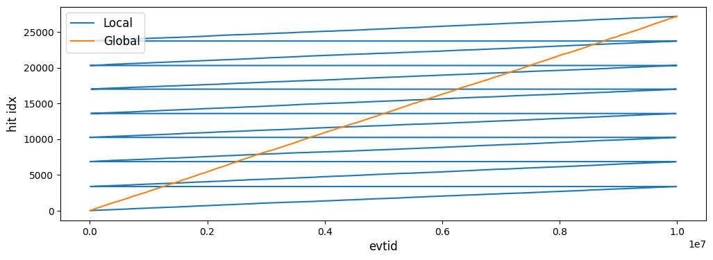
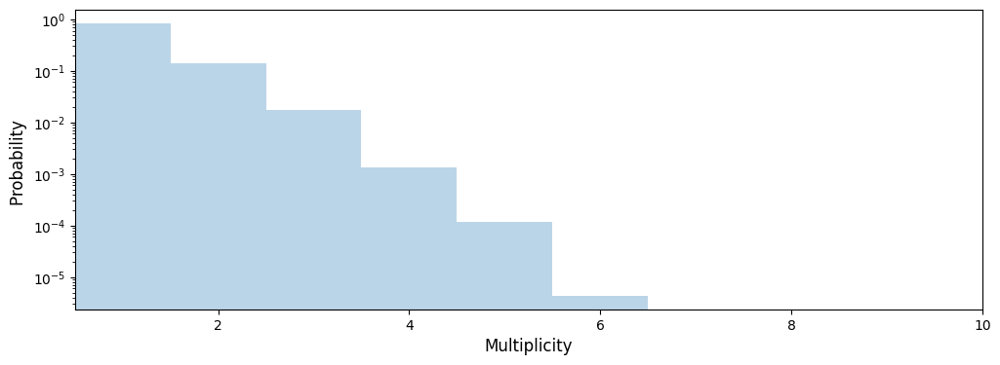
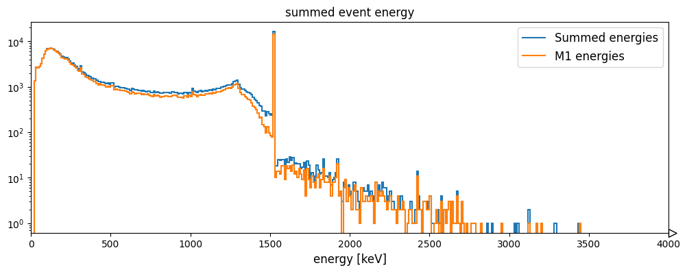
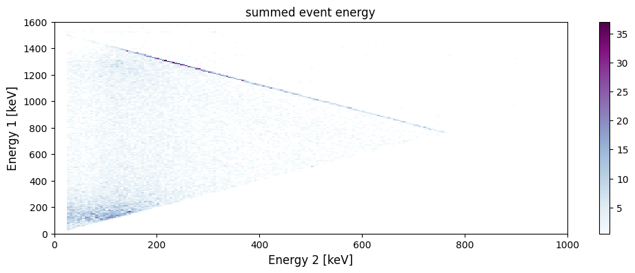

Event tier simulation processing
================================

The next tutorial describes how to combine the information from multiple
detectors, i.e. to create detector-wide “events”, stored in the **evt**
tier.

To demonstrate the power of multi-detector event building we need a
detector system with a large number of detectors. We chose an array of
20 detectors emersed in liquid argon

0) Setting up the python environment
------------------------------------

.. code:: python

    from lgdo import lh5
    from reboost.hpge import hit, tcm
    %load_ext memory_profiler
    import matplotlib.pyplot as plt
    import pyg4ometry as pg4
    import legendhpges
    from legendhpges import draw, make_hpge
    import awkward as ak
    import logging
    import colorlog
    import hist
    import numpy as np

    plt.rcParams['figure.figsize'] = [12, 4]
    plt.rcParams['axes.titlesize'] =12
    plt.rcParams['axes.labelsize'] = 12
    plt.rcParams['legend.fontsize'] = 12

    handler = colorlog.StreamHandler()
    handler.setFormatter(
        colorlog.ColoredFormatter("%(log_color)s%(name)s [%(levelname)s] %(message)s")
    )
    logger = logging.getLogger()
    logger.handlers.clear()
    logger.addHandler(handler)
    logger.setLevel(logging.INFO)
    logger.info("test")

.. parsed-literal::

    The memory_profiler extension is already loaded. To reload it, use:
      %reload_ext memory_profiler

1) Running the simulation
-------------------------

First we generate a geometry and run the simulation. We use similar BeGe
detectors as in the part before

.. code:: python

    reg = pg4.geant4.Registry()

    bege_meta = {
        "name": "B00000B",
        "type": "bege",
        "production": {
            "enrichment": {"val": 0.874, "unc": 0.003},
            "mass_in_g": 697.0,
        },
        "geometry": {
            "height_in_mm": 29.46,
            "radius_in_mm": 36.98,
            "groove": {"depth_in_mm": 2.0, "radius_in_mm": {"outer": 10.5, "inner": 7.5}},
            "pp_contact": {"radius_in_mm": 7.5, "depth_in_mm": 0},
            "taper": {
                "top": {"angle_in_deg": 0.0, "height_in_mm": 0.0},
                "bottom": {"angle_in_deg": 0.0, "height_in_mm": 0.0},
            },
        },
    }

    # make a detector
    bege_l = make_hpge(bege_meta, name="BEGe_L", registry=reg)

    # create a world volume
    world_s = pg4.geant4.solid.Tubs("World_s", 0,60,100,0,2*np.pi, registry=reg, lunit="cm")
    world_l = pg4.geant4.LogicalVolume(world_s, "G4_Galactic", "World", registry=reg)
    reg.setWorld(world_l)

    # let's make a liquid argon balloon
    lar_s = pg4.geant4.solid.Tubs("LAr_s",  0, 20, 40, 0, 2*np.pi, registry=reg, lunit="cm")
    lar_l = pg4.geant4.LogicalVolume(lar_s, "G4_lAr", "LAr_l", registry=reg)
    pg4.geant4.PhysicalVolume([0, 0, 0], [0, 0, 0], lar_l, "LAr", world_l, registry=reg)

    # lets make 4 strings of 5 detectors

    det_count = 0
    for x in [-50,50]:
        for y in [-50,50]:
            for z in [-100,-50,0,50,100]:

                pg4.geant4.PhysicalVolume([0, 0, 0], [x, y,z, "mm"], bege_l, f"BEGe_{det_count}", lar_l, registry=reg)
                det_count+=1

    w = pg4.gdml.Writer()
    w.addDetector(reg)
    w.write("cfg/geom.gdml")

Uncomment the next block to visualise
^^^^^^^^^^^^^^^^^^^^^^^^^^^^^^^^^^^^^

.. code:: python

    viewer = pg4.visualisation.VtkViewerColoured(materialVisOptions={"G4_lAr": [0, 0, 1, 0.1]})
    viewer.addLogicalVolume(reg.getWorldVolume())
    viewer.view()

   image.png

We create our remage macro, this time for K42 in the LAr, a critical
background source in LEGEND!

.. code:: text

   /RMG/Manager/Logging/LogLevel detail

   /RMG/Geometry/RegisterDetector Germanium BEGe_0 000
   /RMG/Geometry/RegisterDetector Germanium BEGe_1 001
   /RMG/Geometry/RegisterDetector Germanium BEGe_2 002
   /RMG/Geometry/RegisterDetector Germanium BEGe_3 003
   /RMG/Geometry/RegisterDetector Germanium BEGe_4 004
   /RMG/Geometry/RegisterDetector Germanium BEGe_5 005
   /RMG/Geometry/RegisterDetector Germanium BEGe_6 006
   /RMG/Geometry/RegisterDetector Germanium BEGe_7 007
   /RMG/Geometry/RegisterDetector Germanium BEGe_8 008
   /RMG/Geometry/RegisterDetector Germanium BEGe_9 009
   /RMG/Geometry/RegisterDetector Germanium BEGe_10 010
   /RMG/Geometry/RegisterDetector Germanium BEGe_11 011
   /RMG/Geometry/RegisterDetector Germanium BEGe_12 012
   /RMG/Geometry/RegisterDetector Germanium BEGe_13 013
   /RMG/Geometry/RegisterDetector Germanium BEGe_14 014
   /RMG/Geometry/RegisterDetector Germanium BEGe_15 015
   /RMG/Geometry/RegisterDetector Germanium BEGe_16 016
   /RMG/Geometry/RegisterDetector Germanium BEGe_17 017
   /RMG/Geometry/RegisterDetector Germanium BEGe_18 018
   /RMG/Geometry/RegisterDetector Germanium BEGe_19 019

   /run/initialize

   /RMG/Generator/Confine Volume
   /RMG/Generator/Confinement/Physical/AddVolume LAr

   /RMG/Generator/Select GPS
   /gps/particle ion
   /gps/energy 0 eV
   /gps/ion 19 42 # 42-K

   /run/beamOn 10000000

2) Remage + hit tier files
--------------------------

For this tutorial we use the same remage simulation as for the hit tier
simulation. See the previous tutorial for how to generate them.

We can check these files.

We run a simplified reboost hit tier processing, unlike that in the
previous tutorial which deliberately included many outputs to show the
effect of processors.

First we define the config file and parameters.

.. code:: python

    chans = [f"det{num:03}" for num in range(20)]

.. code:: python

    chain = {
            "channels": chans,
            "outputs": [
                "t0",                           # first timestamp
                "evtid",                        # id of the hit
                "global_evtid",                 # global id of the hit
                "energy_sum_no_deadlyer",
                "energy_sum"                   # true summed energy before dead layer or smearing
            ],
            "step_group": {
                "description": "group steps by time and evtid with 10us window",
                "expression": "reboost.hpge.processors.group_by_time(stp,window=10)",
            },
            "locals": {
                "hpge": "reboost.hpge.utils.get_hpge(meta_path=meta,pars=pars,detector=detector)",
                "phy_vol": "reboost.hpge.utils.get_phy_vol(reg=reg,pars=pars,detector=detector)",
            },
            "operations": {
                "t0": {
                    "description": "first time in the hit.",
                    "mode": "eval",
                    "expression": "ak.fill_none(ak.firsts(hit.time,axis=-1),np.nan)",
                },
                "evtid": {
                    "description": "global evtid of the hit.",
                    "mode": "eval",
                    "expression": "ak.fill_none(ak.firsts(hit._evtid,axis=-1),np.nan)",
                },
                "global_evtid": {
                    "description": "global evtid of the hit.",
                    "mode": "eval",
                    "expression": "ak.fill_none(ak.firsts(hit._global_evtid,axis=-1),np.nan)",
                },
                "distance_to_nplus_surface_mm": {
                    "description": "distance to the nplus surface in mm",
                    "mode": "function",
                    "expression": "reboost.hpge.processors.distance_to_surface(hit.xloc, hit.yloc, hit.zloc, hpge, phy_vol.position.eval(), surface_type='nplus',unit='m')",
                },
                "activeness": {
                    "description": "activness based on FCCD (no TL)",
                    "mode": "eval",
                    "expression": "ak.where(hit.distance_to_nplus_surface_mm<pars.fccd_in_mm,0,1)",
                },
                "energy_sum_deadlayer": {
                    "description": "summed energy in the hit after deadlayr",
                    "mode": "eval",
                    "expression": "ak.sum(hit.edep*hit.activeness,axis=-1)",
                },
                "energy_sum_no_deadlayer": {
                    "description": "summed energy in the hit after deadlayr",
                    "mode": "eval",
                    "expression": "ak.sum(hit.edep,axis=-1)",
                },
                "energy_sum": {
                    "description": "summed energy after convolution with energy response.",
                    "mode": "function",
                    "expression": "reboost.hpge.processors.smear_energies(hit.energy_sum_deadlayer,reso=pars.fwhm_in_keV/2.355)"
                }

            }
    }

.. code:: python

    ## all detectors have the same performance
    pars = {
        f"det{num:03}": {
            "meta_name":"BEGe.json",
            "phy_vol_name":f"BEGe_{num}",
            "fwhm_in_keV":2.69,
            "fccd_in_mm":1.420, # dead layer in mm
        }
        for num in range(20)

    }

.. code:: python

    %%time
    logger.setLevel(logging.CRITICAL)

    hit.build_hit(file_out="output/hit/output.lh5",list_file_in="output/stp/*.lh5", out_field="hit",in_field="stp",
                  proc_config=chain,pars=pars,gdml="cfg/geom.gdml",metadata_path="cfg/metadata/",merge_input_files=True)
    logger.setLevel(logging.INFO)

.. parsed-literal::

    CPU times: user 23.4 s, sys: 695 ms, total: 24.1 s
    Wall time: 25 s

3) Indices and time-coincidence map
-----------------------------------

In our processing chain we saved both the “local” and “global” evtid,
and we can extract the “hit_idx” as the row of the output table. We can
compare these indices.

.. code:: python

    data_det001 = lh5.read("det001/hit","output/hit/output.lh5")

.. code:: python

    fig,ax = plt.subplots()
    ax.plot(data_det001.evtid,np.arange(len(data_det001.evtid)),label="Local")
    ax.set_xlabel("local evtid")
    ax.set_ylabel("hit idx")

    ax.plot(data_det001.global_evtid,np.arange(len(data_det001.global_evtid)),label="Global")
    ax.set_xlabel("evtid")
    ax.set_ylabel("hit idx")
    ax.legend(loc="upper left")

.. parsed-literal::

    <matplotlib.legend.Legend at 0x7fa819de8590>

We see that the local index varies between 0 and 1e7 per file while the
global index increases constantly. We can even check this (as it must
from our hit tier processing).

.. code:: python

    evtid_change = np.diff(data_det001.global_evtid)

.. code:: python

    print(f"evtid change = {evtid_change}, increasing? {np.all(evtid_change>=0)}")

.. parsed-literal::

    evtid change = [843. 153. 313. ...  27. 500. 345.], increasing? True

Now we can build the time-coincidence map and save to a new file.

.. code:: python

    %%memit
    tcm.build_tcm("output/hit/output.lh5","output/tcm/test_tcm.lh5",chans,time_name="t0",idx_name="global_evtid")

.. parsed-literal::

    peak memory: 690.61 MiB, increment: 0.27 MiB

We see that building the TCM was fast only taking around 1s. However
since building the TCM requires reading all the files simultaneously we
should be careful about the memory usage. Here using around 1 GB is
still quite significant.

   **Technical note**: - The code reads all the hit files in
   simultaneously, this could cause a memory issue if the file is very
   large - In this case the user must break the hit tier file into more
   chunks (see build_hit) options

Now we can look at our TCM.

.. code:: python

    tcm_ak = lh5.read("tcm","output/tcm/test_tcm.lh5").view_as("ak")

.. code:: python

    lh5.show("output/tcm/test_tcm.lh5")

.. code:: python

    tcm_ak

.. raw:: html

    <prepython[{array_id: [11], array_idx: [0]},
     {array_id: [2], array_idx: [0]},
     {array_id: [11], array_idx: [1]},
     {array_id: [8], array_idx: [0]},
     {array_id: [3], array_idx: [0]},
     {array_id: [5, 16], array_idx: [0, 0]},
     {array_id: [0], array_idx: [0]},
     {array_id: [13], array_idx: [0]},
     {array_id: [18], array_idx: [0]},
     {array_id: [7], array_idx: [0]},
     ...,
     {array_id: [9, 8], array_idx: [25998, 26398]},
     {array_id: [17], array_idx: [27265]},
     {array_id: [17], array_idx: [27266]},
     {array_id: [3, 4], array_idx: [26889, 26009]},
     {array_id: [15], array_idx: [27763]},
     {array_id: [12], array_idx: [27111]},
     {array_id: [13], array_idx: [26832]},
     {array_id: [17], array_idx: [27267]},
     {array_id: [19], array_idx: [25884]}]
    -----------------------------------------------
    type: 458647 * {
        array_id: var * int64,
        array_idx: var * int64
    }</pre>

We see that almost all of the events have only trigger in a single
channel. We can also extract easily the multiplicity of the events or
the number of triggers in the TCM.

More sophisticated calcations can be performed by also grabbing
information from the hit tier files. This is done by ``build_evt``.

.. code:: python

    plt.hist(ak.num(tcm_ak.array_id,axis=-1),range=(.5,20.5),bins=20,alpha=0.3,density=True)
    plt.yscale("log")
    plt.xlim(0.5,10)
    plt.xlabel("Multiplicity")
    plt.ylabel("Probability ")

.. parsed-literal::

    Text(0, 0.5, 'Probability ')

3.1) TCM ``id``,\ ``idx`` and ``index``
^^^^^^^^^^^^^^^^^^^^^^^^^^^^^^^^^^^^^^^

Internally we have three different TCM attributes. \* ``tcm.idx`` : the
row of the hit table \* ``tcm.id`` : the channel number \*
``tcm.index``: the row of the flattened tcm the hit corresponds to

This names are surely very confusing but are inherited from pygama and
will be updated in future.

These are computed with the following block of code:

.. code:: python

       idx_ch = tcm.idx[tcm.id == table_id]
       outsize = len(idx_ch)

       if expr == "tcm.array_id":
           res = np.full(outsize, table_id, dtype=int)
       elif expr == "tcm.array_idx":
           res = idx_ch
       elif expr == "tcm.index":
           res = np.where(tcm.id == table_id)[0]

4) Generating the event tier
----------------------------

Next we can use our time-coincidence-map to generate files containing
information on each event. Similar to the ``hit`` tier the processing is
based on a YAML or JSON configuration file.

This config file must contain a key with lists of different groups of
channels. It must define the output fields and then finally a block of
operations to perform. Similar to our hit tier processing the idea is
that each operation / processor computes an LGDO object
(``VectorOfVectors``, ``Array`` or ``ArrayOfEqualSizedArrays``) with the
same length as the TCM.

We can define some groups of channels for our processing chain. Lets set
some channels off and some to ac (this means the channel is used for
anticoincidence but is not fully usable).

.. code:: python

    chans_off = ["det003","det007"]
    chans_ac = ["det013","det016"]
    chans_on = [chan for chan in chans if (chan not in chans_off) and (chan not in chans_ac) ]
    chans_on

.. parsed-literal::

    ['det000',
     'det001',
     'det002',
     'det004',
     'det005',
     'det006',
     'det008',
     'det009',
     'det010',
     'det011',
     'det012',
     'det014',
     'det015',
     'det017',
     'det018',
     'det019']

We create a simple event tier processing config demonstrating the
different possible aggregation modes.

   **Note**: this processing chain deliberately includes some additional
   operations to show the effect of each aggregation mode. It: 1. finds
   the channel ids with energy above threshold 2. finds the TCM
   “index’s” or the index of the TCM VoV 3. computes a vector of vector
   of the energies (ordered by channel) 4. computes a boolean flag of
   whether each channel is ON (and not AC) 5. computes another flag
   checking if each hit is above threshold 6. checks if the event
   contains any AC hits 7. computes the summed energy, the first
   timestamp and the multiplicity

.. code:: python

    evt_config = {
        "channels": {
                "geds_on":chans_on,
                "geds_ac":chans_ac
        },
        "outputs": [
            "channel_id",
            "all_channel_id",
            "tcm_index",
            "is_good_channels",
            "energy_sum",
            "energy_vector",
            "energy_no_threshold",
            "is_all_above_threshold",
            "t0",
            "is_good_event",
            "multiplicity"
        ],
        "operations": {
            "channel_id": {
                "channels":["geds_on","geds_ac"],
                "aggregation_mode": "gather",
                "query": "hit.energy_sum > 25",
                "expression": "tcm.array_id",
                "sort":"descend_by:hit.energy_sum"
            },
            "all_channel_id": {
                "channels":["geds_on","geds_ac"],
                "aggregation_mode": "gather",
                "expression": "tcm.array_id",
                "sort":"descend_by:hit.energy_sum"
            },
            "tcm_index": {
                "channels":["geds_on","geds_ac"],
                "aggregation_mode": "gather",
                "query": "hit.energy_sum > 25",
                "expression": "tcm.index"
            },
            "energy_no_threshold": {
                "channels":["geds_on"],
                "aggregation_mode": "keep_at_ch:evt.all_channel_id",
                "expression": "hit.energy_sum"
            },
            "energy_vector": {
                "channels":["geds_on"],
                "aggregation_mode": "keep_at_ch:evt.channel_id",
                "expression": "hit.energy_sum"
            },
            "is_good_channels":{
                "channels":["geds_on","geds_ac"],
                "aggregation_mode":"keep_at_idx:evt.tcm_index",
                "expression":"True",
                "initial":False,
                "exclude_channels":"geds_ac"
            },
            "is_all_above_threshold" :{
                "channels":["geds_on","geds_ac"],
                "aggregation_mode":"all",
                "expression":"hit.energy_sum>25",
                "initial":True
            },
            "is_good_event" :{
                "expression":"ak.all(evt.is_good_channels,axis=-1)"
            },

            "energy_sum": {
                "channels":["geds_on"],
                "aggregation_mode": "sum",
                "query":"hit.energy_sum > 25",
                "expression": "hit.energy_sum",
                "initial":0
            },
            "t0": {
                "channels":["geds_on"],
                "aggregation_mode": "first_at:hit.t0",
                "expression": "hit.t0"
            },
            "multiplicity": {
                "channels": ["geds_on"],
                "aggregation_mode": "sum",
                "expression": "hit.energy_sum > 25",
                "initial": 0
            }
        }
    }

.. code:: python

    from reboost.hpge import evt
    logger.setLevel(logging.INFO)

.. code:: python

    %%time
    evt_ak = evt.build_evt(hit_file="output/hit/output.lh5",tcm_file = "output/tcm/test_tcm.lh5",evt_file=None,config = evt_config)

.. parsed-literal::

    CPU times: user 5.21 s, sys: 530 ms, total: 5.74 s
    Wall time: 5.74 s

4.1) “Gather” aggregation mode
^^^^^^^^^^^^^^^^^^^^^^^^^^^^^^

The gather mode is used by the ``channel_id`` and ``tcm_index``
processors. It returns a VectorOfVector of the expression evaluated for
each hit in the event. \* the “query” removes some hits below the energy
threshold. \* “channels” defines the channels to include \* “sort”,
controls which order the values are in.

For example we see that the “channel_id” is just a subset of the
original ``tcm_id`` removing some hits (below 25 keV) and changing the
order in some cases. These fields are then useful to extract values from
other fields keeping the correspondence with channel or tcm index.

.. code:: python

    print("tcm.array_id       ",tcm_ak.array_id)
    print("evt.all_channel_id ",evt_ak.all_channel_id)
    print("evt.channel_id     ",evt_ak.channel_id)
    print("evt.tcm_index      ",evt_ak.tcm_index)

.. parsed-literal::

    tcm.array_id        [[11], [2], [11], [8], [3], [5, 16], ..., [...], [15], [12], [13], [17], [19]]
    evt.all_channel_id  [[11], [2], [11], [8], [], [16, 5], [0], ..., [4], [15], [12], [13], [17], [19]]
    evt.channel_id      [[11], [], [11], [], [], [16, 5], [0], ..., [4], [15], [], [13], [17], [19]]
    evt.tcm_index       [[0], [], [2], [], [], [...], ..., [540269], [], [540271], [540272], [540273]]

4.2) “keep_at_ch” and “keep_at_idx”
^^^^^^^^^^^^^^^^^^^^^^^^^^^^^^^^^^^

These modes are similar but order the results according to either the
TCM index or the channel id fields. In our processing chain we used this
to extract the energies preserving the order with respect to the
channel_id. We see in both cases there are some “nan” values
(corresponding to the “geds_ac” channels) and some elements are removed
by the energy threshold.

.. code:: python

    print("evt.energy_vector        ",evt_ak.energy_vector)
    print("evt.energy_no_threshold  ",evt_ak.energy_no_threshold)

.. parsed-literal::

    evt.energy_vector         [[894], [], [125], [], [], [nan, ...], ..., [784], [], [nan], [1.36e+03], [258]]
    evt.energy_no_threshold   [[894], [0.761], [125], [-1.65], [], ..., [-0.79], [nan], [1.36e+03], [258]]

Or we can check if each channel is in AC mode.

.. code:: python

    print("evt.is_good_channels ",evt_ak.is_good_channels)

.. parsed-literal::

    evt.is_good_channels  [[True], [], [True], [], [], [...], ..., [True], [], [False], [True], [True]]

4.3) “all” or “sum” mode
^^^^^^^^^^^^^^^^^^^^^^^^

These modes aggregate the data from each channel by either summation or
all. Thus we get out a 1D vector.

For example we checked if every hit is above threshold (compare to the
energy vectors), compute the total energy and check the number of
channels above threshold (multiplicity).

.. code:: python

    print("evt_ak.is_all_above_threshold ",evt_ak.is_all_above_threshold)
    print("evt_ak.energy_sum             ",evt_ak.energy_sum)
    print("evt_ak.energy_sum             ",evt_ak.energy_sum)
    print("evt_ak.multiplicity           ",evt_ak.multiplicity)

.. parsed-literal::

    evt_ak.is_all_above_threshold  [True, False, True, False, True, True, ..., True, True, False, True, True, True]
    evt_ak.energy_sum              [894, 0, 125, 0, 0, 437, 147, 0, ..., 1.22e+03, 218, 784, 0, 0, 1.36e+03, 258]
    evt_ak.energy_sum              [894, 0, 125, 0, 0, 437, 147, 0, ..., 1.22e+03, 218, 784, 0, 0, 1.36e+03, 258]
    evt_ak.multiplicity            [1, 0, 1, 0, 0, 1, 1, 0, 0, 0, 0, 1, 1, ..., 1, 1, 0, 2, 0, 1, 1, 1, 0, 0, 1, 1]

4.4) No aggregation mode
^^^^^^^^^^^^^^^^^^^^^^^^

Finally, we can perform some basic operations on evt tier variables, eg.
first checking if any above threshold channel is in AC mode.

.. code:: python

    print("evt_ak.is_good_event           ",evt_ak.is_good_event)

.. parsed-literal::

    evt_ak.is_good_event            [True, True, True, True, True, False, ..., True, True, True, False, True, True]

5) Analysis on the event tier data
^^^^^^^^^^^^^^^^^^^^^^^^^^^^^^^^^^

Finally with our new evt files we can make some plots of experiment wide
quantities.

.. code:: python

    def plot_energy(axes,energy,bins=400,xrange=None,label=" ",log_y=True,**kwargs):

        h=hist.new.Reg(bins,*xrange, name="energy [keV]").Double()
        h.fill(energy)
        h.plot(**kwargs,label=label)
        axes.legend()
        if (log_y):
            axes.set_yscale("log")
        if xrange is not None:
            axes.set_xlim(*xrange)

.. code:: python

    fig, ax = plt.subplots()
    plot_energy(ax,evt_ak.energy_sum[evt_ak.multiplicity>0],yerr=False,label="Summed energies",xrange=(0,4000))
    plot_energy(ax,ak.flatten(evt_ak[evt_ak.multiplicity==1].energy_vector),yerr=False,label="M1 energies",xrange=(0,4000))

    ax.set_title("summed event energy")

.. parsed-literal::

    Text(0.5, 1.0, 'summed event energy')

Or we can select multiplicity two (M2) events and plot the 2D energy
spectra.

.. code:: python

    import matplotlib as mpl

.. code:: python

    def plot_energy_2D(axes,energy_1,energy_2,bins=400,xrange=None,yrange=None,label=" ",**kwargs):

        x_axis = hist.axis.Regular(bins, *xrange, name="Energy 2 [keV]")
        y_axis = hist.axis.Regular(bins, *yrange, name="Energy 1 [keV]")
        h = hist.Hist(x_axis, y_axis)
        h.fill(energy_2,energy_1)
        cmap = mpl.colormaps["BuPu"].copy()
        cmap.set_under(color="white")

        w, x, y = h.to_numpy()
        mesh = ax.pcolormesh(x, y, w.T, cmap=cmap,vmin=0.5)
        ax.set_xlabel("Energy 2 [keV]")
        ax.set_ylabel("Energy 1 [keV]")
        fig.colorbar(mesh)

        if xrange is not None:
            axes.set_xlim(*xrange)

.. code:: python

    fig, ax = plt.subplots()

    energy_1 = np.array(evt_ak[(evt_ak.multiplicity==2)&(evt_ak.is_good_event)].energy_vector[:,1])
    energy_2 = np.array(evt_ak[(evt_ak.multiplicity==2)&(evt_ak.is_good_event)].energy_vector[:,0])
    plot_energy_2D(ax,energy_2,energy_1,label=None,xrange=(0,1000),yrange=(0,1600),bins=200,vmin=0.5)
    ax.set_title("summed event energy")

.. parsed-literal::

    Text(0.5, 1.0, 'summed event energy')

Many more things are possible via manipulation of our event tier files,
the recommended tool is awkward (see
`[docs] <https://awkward-array.org/doc/main/>`__).
