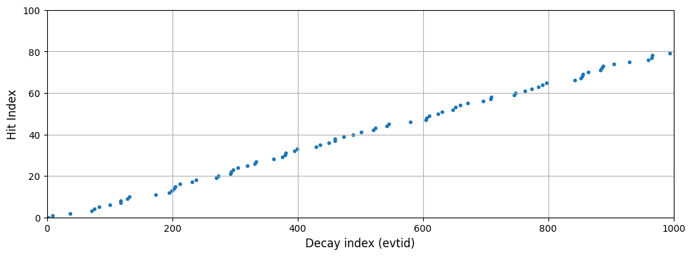
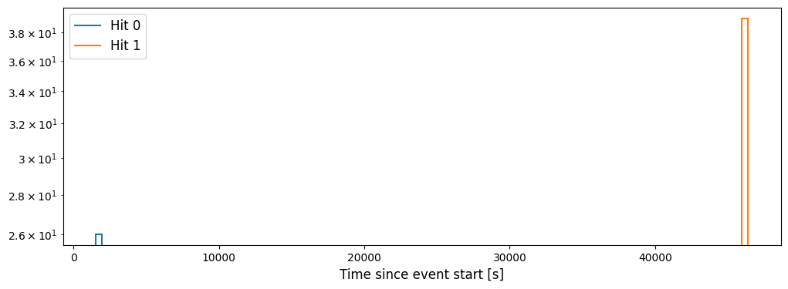
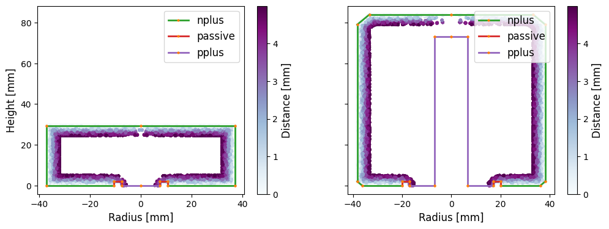
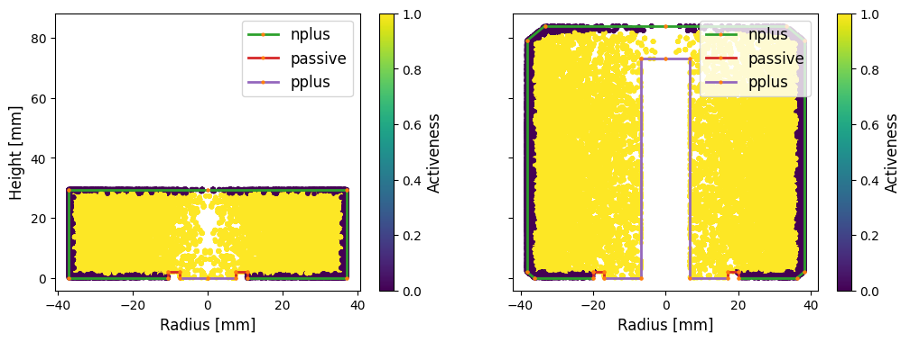
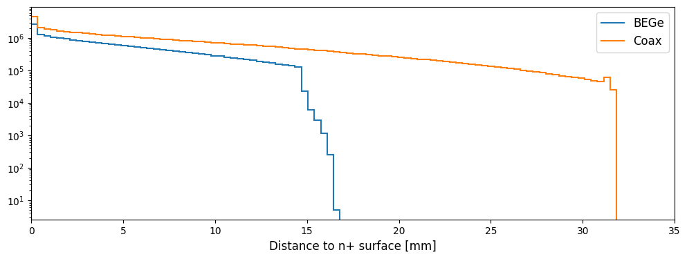
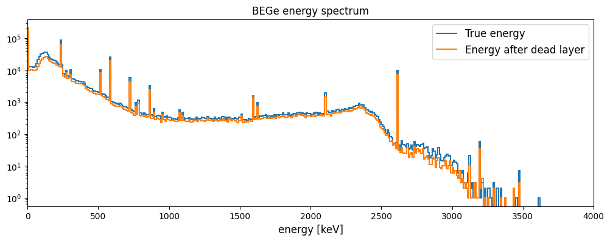
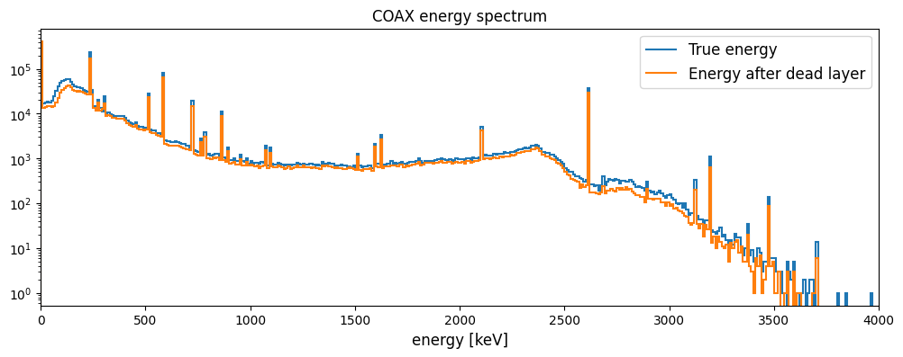
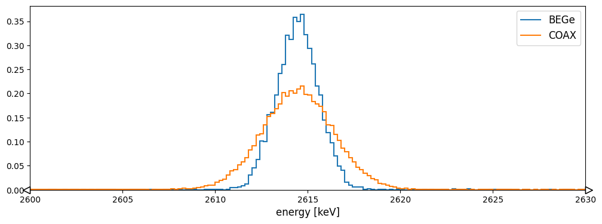

Hit tier hpge simulation processing
===================================

This tutorial describes how to process the HPGe detector simulations
from **remage** with **reboost**. It buils on the official **remage**
tutorial
`[link] <https://remage.readthedocs.io/en/stable/tutorial.html>`__

   .. rubric:: *Note*
      :name: note

   To run this tutorial it is recommended to create the following
   directory structure to organise the outputs and config inputs.

.. code:: text

   ├── cfg
   │   └── metadata
   ├── output
   │   ├── stp
   │   └── hit
   └── reboost_hpge_tutorial.ipynb

Part 1) Running the remage simulation
-------------------------------------

Before we can run any post-processing we need to run the Geant4
simulation. For this we follow the remage tutorial to generate the GDML
geometry. We save this into the GDML file *cfg/geom.gdml* for use by
remage. We also need to save the metadata dictionaries into json files
(in the *cfg/metadata* folder as *BEGe.json* and *Coax.json*

We use a slightly modified Geant4 macro to demonstrate some features of
reboost (this should be saved as *cfg/th228.mac* to run remage on the
command line).

.. code:: text

   /RMG/Manager/Logging/LogLevel detail

   /RMG/Geometry/RegisterDetector Germanium BEGe 001
   /RMG/Geometry/RegisterDetector Germanium Coax 002
   /RMG/Geometry/RegisterDetector Scintillator LAr 003

   /run/initialize

   /RMG/Generator/Confine Volume
   /RMG/Generator/Confinement/Physical/AddVolume Source

   /RMG/Generator/Select GPS
   /gps/particle ion
   /gps/energy 0 eV
   /gps/ion 88 224 # 224-Ra
   /process/had/rdm/nucleusLimits 208 224 81 88 #Ra-224 to 208-Pb

   /run/beamOn 1000000

We then use the remage executable (see
`[remage-docs] <https://remage.readthedocs.io/en/stable/>`__ for
installation instructions) to run the simulation: > #### *Note* > Both
of *cfg/th228.mac* and *cfg/geometry.gdml* are needed to run remage

.. code:: console

   $ remage --threads 8 --gdml-files cfg/geom.gdml --output-file output/stp/output.lh5 -- cfg/th228.mac

You can lower the number of simulated events to speed up the simulation.

We can use ``lh5.show()`` to check the output files.

.. code:: ipython3

    from lgdo import lh5

.. code:: ipython3

    lh5.show("output/stp/output_t0.lh5")

.. parsed-literal::

    /
    └── stp · struct{det001,det002,det003,vertices} 
        ├── det001 · table{evtid,particle,edep,time,xloc,yloc,zloc} 
        │   ├── edep · array<1>{real} 
        │   ├── evtid · array<1>{real} 
        │   ├── particle · array<1>{real} 
        │   ├── time · array<1>{real} 
        │   ├── xloc · array<1>{real} 
        │   ├── yloc · array<1>{real} 
        │   └── zloc · array<1>{real} 
        ├── det002 · table{evtid,particle,edep,time,xloc,yloc,zloc} 
        │   ├── edep · array<1>{real} 
        │   ├── evtid · array<1>{real} 
        │   ├── particle · array<1>{real} 
        │   ├── time · array<1>{real} 
        │   ├── xloc · array<1>{real} 
        │   ├── yloc · array<1>{real} 
        │   └── zloc · array<1>{real} 
        ├── det003 · table{evtid,particle,edep,time,xloc_pre,yloc_pre,zloc_pre,xloc_post,yloc_post,zloc_post,v_pre,v_post} 
        │   ├── edep · array<1>{real} 
        │   ├── evtid · array<1>{real} 
        │   ├── particle · array<1>{real} 
        │   ├── time · array<1>{real} 
        │   ├── v_post · array<1>{real} 
        │   ├── v_pre · array<1>{real} 
        │   ├── xloc_post · array<1>{real} 
        │   ├── xloc_pre · array<1>{real} 
        │   ├── yloc_post · array<1>{real} 
        │   ├── yloc_pre · array<1>{real} 
        │   ├── zloc_post · array<1>{real} 
        │   └── zloc_pre · array<1>{real} 
        └── vertices · table{evtid,time,xloc,yloc,zloc,n_part} 
            ├── evtid · array<1>{real} 
            ├── n_part · array<1>{real} 
            ├── time · array<1>{real} 
            ├── xloc · array<1>{real} 
            ├── yloc · array<1>{real} 
            └── zloc · array<1>{real} 

Part 2) reboost config files
----------------------------

For this tutorial we perform a basic post-processing of the *hit* tier
for the two Germanium channels.

2.1) Setup the environment
~~~~~~~~~~~~~~~~~~~~~~~~~~

First we set up the python environment.

.. code:: ipython3

    from reboost.hpge import hit
    import matplotlib.pyplot as plt
    import pyg4ometry as pg4
    import legendhpges
    from legendhpges import draw
    import awkward as ak
    import logging
    import colorlog
    import hist
    import numpy as np
    
    
    plt.rcParams['figure.figsize'] = [12, 4]
    plt.rcParams['axes.titlesize'] =12
    plt.rcParams['axes.labelsize'] = 12
    plt.rcParams['legend.fontsize'] = 12
    
    
    handler = colorlog.StreamHandler()
    handler.setFormatter(
        colorlog.ColoredFormatter("%(log_color)s%(name)s [%(levelname)s] %(message)s")
    )
    logger = logging.getLogger()
    logger.handlers.clear()
    logger.addHandler(handler)
    logger.setLevel(logging.INFO)
    logger.info("test")
    

.. parsed-literal::

    root [INFO] test

2.2) Processing chain and parameters
~~~~~~~~~~~~~~~~~~~~~~~~~~~~~~~~~~~~

Next we need to make the processing chain config file.

The processing chain below gives a standard set of steps for a HPGe
simulation. 1. first the steps are windowed into hits, 2. the first
timestamp and index of each hit is computed (for use in event building),
3. the distance to the detector n+ surface is computed and from this the
activeness is calculated (based on the FCCD) 4. the energy in each step
is summed to extract the deposited energy (both with and without
deadlayer correction), 5. the energy is convolved with the detector
response model (gaussian energy resolution).

We also include some step based quantities in the output to show the
effect of the processors.

.. code:: ipython3

    chain = {
            "channels": [
                "det001",
                "det002"
            ],
            "outputs": [
                "t0",                           # first timestamp
                "time",                         # time of each step
                "edep",                         # energy deposited in each step
                "evtid",                    # id of the hit
                "global_evtid",             # global id of the hit
                "distance_to_nplus_surface_mm", # distance to detector nplus surface
                "activeness",                   # activeness for the step
                "rpos_loc",                     # radius of step
                "zpos_loc",                     # z position
                "energy_sum",                   # true summed energy before dead layer or smearing
                "energy_sum_deadlayer",         # energy sum after dead layers
                "energy_sum_smeared"            # energy sum after smearing with resolution
            ],
            "step_group": {          
                "description": "group steps by time and evtid with 10us window",
                "expression": "reboost.hpge.processors.group_by_time(stp,window=10)",
            },
            "locals": {
                "hpge": "reboost.hpge.utils.get_hpge(meta_path=meta,pars=pars,detector=detector)",
                "phy_vol": "reboost.hpge.utils.get_phy_vol(reg=reg,pars=pars,detector=detector)",
            },
            "operations": {
                "t0": {
                    "description": "first time in the hit.",
                    "mode": "eval",
                    "expression": "ak.fill_none(ak.firsts(hit.time,axis=-1),np.nan)",
                },
                "evtid": {
                    "description": "global evtid of the hit.",
                    "mode": "eval",
                    "expression": "ak.fill_none(ak.firsts(hit._evtid,axis=-1),np.nan)",
                },
                "global_evtid": {
                    "description": "global evtid of the hit.",
                    "mode": "eval",
                    "expression": "ak.fill_none(ak.firsts(hit._global_evtid,axis=-1),np.nan)",
                },
                "distance_to_nplus_surface_mm": {
                    "description": "distance to the nplus surface in mm",
                    "mode": "function",
                    "expression": "reboost.hpge.processors.distance_to_surface(hit.xloc, hit.yloc, hit.zloc, hpge, phy_vol.position.eval(), surface_type='nplus',unit='m')",
                },
                "activeness": {
                    "description": "activness based on FCCD (no TL)",
                    "mode": "eval",
                    "expression": "ak.where(hit.distance_to_nplus_surface_mm<pars.fccd_in_mm,0,1)",
                },
                 "rpos_loc": {
                    "description": "Local radius ",
                    "mode": "eval",
                    "expression": "((1000*hit.xloc-phy_vol.position.eval()[0])**2+(1000*hit.yloc-phy_vol.position.eval()[1])**2)**0.5"
                },
                 "zpos_loc": {
                    "description": "Local z ",
                    "mode": "eval",
                    "expression": "1000*hit.zloc-phy_vol.position.eval()[2]"
                },
                "energy_sum": {
                    "description": "truth summed energy in the hit.",
                    "mode": "eval",
                    "expression": "ak.sum(hit.edep,axis=-1)",
                },
                "energy_sum_deadlayer": {
                    "description": "summed energy in the hit after deadlayr",
                    "mode": "eval",
                    "expression": "ak.sum(hit.edep*hit.activeness,axis=-1)",
                },
                "energy_sum_smeared": {
                    "description": "summed energy after convolution with energy response.",
                    "mode": "function",
                    "expression": "reboost.hpge.processors.smear_energies(hit.energy_sum_deadlayer,reso=pars.fwhm_in_keV/2.355)"
                }
        
            }
    }

We also create our parameters file.

.. code:: ipython3

    pars = {
        "det001": {
            "meta_name":"BEGe.json",
            "phy_vol_name":"BEGe",
            "fwhm_in_keV":2.69, 
            "fccd_in_mm":1.420, # dead layer in mm     
        },
        "det002": {
            "meta_name":"Coax.json",
            "phy_vol_name":"Coax",
            "fwhm_in_keV":4.420, 
            "fccd_in_mm":2.69,   
        }
        
    }

Part 3) Running the processing
------------------------------

Now we can run our post-processing

.. code:: ipython3

    %%time
    hit.build_hit(file_out="output/hit/output.lh5",list_file_in="output/stp/*.lh5", out_field="hit",in_field="stp",
                  proc_config=chain,pars=pars,gdml="cfg/geom.gdml",metadata_path="cfg/metadata/",merge_input_files=True)

.. parsed-literal::

    reboost.hpge.utils [INFO] files contain [1252152, 1248990, 1244422, 1248990, 1258476, 1252152, 1252152, 1242666] events
    reboost.hpge.hit [INFO] ...running hit tier for output/stp/output_t0.lh5 and det001
    reboost.hpge.hit [INFO] ...running hit tier for output/stp/output_t0.lh5 and det002
    reboost.hpge.hit [INFO] ...running hit tier for output/stp/output_t1.lh5 and det001
    reboost.hpge.hit [INFO] ...running hit tier for output/stp/output_t1.lh5 and det002
    reboost.hpge.hit [INFO] ...running hit tier for output/stp/output_t2.lh5 and det001
    reboost.hpge.hit [INFO] ...running hit tier for output/stp/output_t2.lh5 and det002
    reboost.hpge.hit [INFO] ...running hit tier for output/stp/output_t3.lh5 and det001
    reboost.hpge.hit [INFO] ...running hit tier for output/stp/output_t3.lh5 and det002
    reboost.hpge.hit [INFO] ...running hit tier for output/stp/output_t4.lh5 and det001
    reboost.hpge.hit [INFO] ...running hit tier for output/stp/output_t4.lh5 and det002
    reboost.hpge.hit [INFO] ...running hit tier for output/stp/output_t5.lh5 and det001
    reboost.hpge.hit [INFO] ...running hit tier for output/stp/output_t5.lh5 and det002
    reboost.hpge.hit [INFO] ...running hit tier for output/stp/output_t6.lh5 and det001
    reboost.hpge.hit [INFO] ...running hit tier for output/stp/output_t6.lh5 and det002
    reboost.hpge.hit [INFO] ...running hit tier for output/stp/output_t7.lh5 and det001
    reboost.hpge.hit [INFO] ...running hit tier for output/stp/output_t7.lh5 and det002

.. parsed-literal::

    CPU times: user 2min 38s, sys: 4.73 s, total: 2min 42s
    Wall time: 2min 45s

The debugging info printed by *reboost* shows the program iterating over
the files and appending to the output file. Now we can print our output
file structure showing the new *hit* oriented data format.

.. code:: ipython3

    lh5.show("output/hit/output.lh5")

.. parsed-literal::

    /
    ├── det001 · HDF5 group 
    │   └── hit · table{edep,time,t0,evtid,global_evtid,distance_to_nplus_surface_mm,activeness,rpos_loc,zpos_loc,energy_sum,energy_sum_deadlayer,energy_sum_smeared} 
    │       ├── activeness · array<1>{array<1>{real}} 
    │       │   ├── cumulative_length · array<1>{real} 
    │       │   └── flattened_data · array<1>{real} 
    │       ├── distance_to_nplus_surface_mm · array<1>{array<1>{real}} 
    │       │   ├── cumulative_length · array<1>{real} 
    │       │   └── flattened_data · array<1>{real} 
    │       ├── edep · array<1>{array<1>{real}} 
    │       │   ├── cumulative_length · array<1>{real} 
    │       │   └── flattened_data · array<1>{real} 
    │       ├── energy_sum · array<1>{real} 
    │       ├── energy_sum_deadlayer · array<1>{real} 
    │       ├── energy_sum_smeared · array<1>{real} 
    │       ├── evtid · array<1>{real} 
    │       ├── global_evtid · array<1>{real} 
    │       ├── rpos_loc · array<1>{array<1>{real}} 
    │       │   ├── cumulative_length · array<1>{real} 
    │       │   └── flattened_data · array<1>{real} 
    │       ├── t0 · array<1>{real} 
    │       ├── time · array<1>{array<1>{real}} 
    │       │   ├── cumulative_length · array<1>{real} 
    │       │   └── flattened_data · array<1>{real} 
    │       └── zpos_loc · array<1>{array<1>{real}} 
    │           ├── cumulative_length · array<1>{real} 
    │           └── flattened_data · array<1>{real} 
    └── det002 · HDF5 group 
        └── hit · table{edep,time,t0,evtid,global_evtid,distance_to_nplus_surface_mm,activeness,rpos_loc,zpos_loc,energy_sum,energy_sum_deadlayer,energy_sum_smeared} 
            ├── activeness · array<1>{array<1>{real}} 
            │   ├── cumulative_length · array<1>{real} 
            │   └── flattened_data · array<1>{real} 
            ├── distance_to_nplus_surface_mm · array<1>{array<1>{real}} 
            │   ├── cumulative_length · array<1>{real} 
            │   └── flattened_data · array<1>{real} 
            ├── edep · array<1>{array<1>{real}} 
            │   ├── cumulative_length · array<1>{real} 
            │   └── flattened_data · array<1>{real} 
            ├── energy_sum · array<1>{real} 
            ├── energy_sum_deadlayer · array<1>{real} 
            ├── energy_sum_smeared · array<1>{real} 
            ├── evtid · array<1>{real} 
            ├── global_evtid · array<1>{real} 
            ├── rpos_loc · array<1>{array<1>{real}} 
            │   ├── cumulative_length · array<1>{real} 
            │   └── flattened_data · array<1>{real} 
            ├── t0 · array<1>{real} 
            ├── time · array<1>{array<1>{real}} 
            │   ├── cumulative_length · array<1>{real} 
            │   └── flattened_data · array<1>{real} 
            └── zpos_loc · array<1>{array<1>{real}} 
                ├── cumulative_length · array<1>{real} 
                └── flattened_data · array<1>{real} 

The new format is a factor of x17 times smaller than the input file due
to the removal of many *step* based fields which use a lot of memory and
due to the removal of the *vertices* table and the LAr hits. So we can
easily read the whole file into memory. We use *awkward* to analyse the
output files.

.. code:: ipython3

    data_det001 = lh5.read_as("det001/hit","output/hit/output.lh5","ak")
    data_det002 = lh5.read_as("det002/hit","output/hit/output.lh5","ak")

.. code:: ipython3

    data_det001

.. raw:: html

    <pre>[{edep: [0.0826, 0.00863, ..., 32.3], time: [1.32e+15, ...], t0: 1.32e+15, ...},
     {edep: [0.103, 0.0256, ..., 37.6, 6.44], time: [...], t0: 1.24e+15, ...},
     {edep: [0.0824, 0.00863, ..., 16.8], time: [2.21e+14, ...], t0: 2.21e+14, ...},
     {edep: [0.101, 0.0802, ..., 20.9], time: [9.09e+14, ...], t0: 9.09e+14, ...},
     {edep: [0.00332, 0.0171, ..., 45, 27.7], time: [...], t0: 4.26e+13, ...},
     {edep: [0.0845, 0.00863, ..., 27.9], time: [6.86e+14, ...], t0: 6.86e+14, ...},
     {edep: [0.0065, 0.255, ..., 41.5, 2.69], time: [...], t0: 1.24e+14, ...},
     {edep: [0.0388, 0.188, ..., 1.1, 41.5], time: [...], t0: 6.48e+14, ...},
     {edep: [0.00332, 0.116, ..., 16.2], time: [4.39e+14, ...], t0: 4.39e+14, ...},
     {edep: [0.00615, 0.0204, ..., 22.1], time: [7.11e+14, ...], t0: 7.11e+14, ...},
     ...,
     {edep: [0.19, 0.0171, ..., 42.2, 10.9], time: [...], t0: 1.1e+15, ...},
     {edep: [0.0118, 0.0303, ..., 34.5, 21.4], time: [...], t0: 1.51e+15, ...},
     {edep: [0.0204, 0.152, ..., 2.79, 51.9], time: [...], t0: 9.73e+14, ...},
     {edep: [0.118, 0.0254, ..., 41.2, 38.6], time: [...], t0: 9.67e+14, ...},
     {edep: [0.0824, 0.0254, ..., 34.6, 18.9], time: [...], t0: 6.64e+14, ...},
     {edep: [0.148, 0.0802, ..., 40.9, 24], time: [...], t0: 5.56e+14, ...},
     {edep: [0.022, 0.0148, ..., 34.8, 11.9], time: [...], t0: 6.52e+14, ...},
     {edep: [0.0155, 0.118, ..., 0.458, 9.65], time: [...], t0: 3.97e+14, ...},
     {edep: [0.0065, 0.00615, ..., 13.7], time: [3.98e+14, ...], t0: 3.98e+14, ...}]
    --------------------------------------------------------------------------------
    type: 835793 * {
        edep: var * float64,
        time: var * float64,
        t0: float64,
        evtid: float64,
        global_evtid: float64,
        distance_to_nplus_surface_mm: var * float64,
        activeness: var * int64,
        rpos_loc: var * float64,
        zpos_loc: var * float64,
        energy_sum: float64,
        energy_sum_deadlayer: float64,
        energy_sum_smeared: float64
    }</pre>

Part 4) Steps in a standard processing chain
--------------------------------------------

The next part of the tutorial gives more details on each step of the
processing chain.

4.1) Windowing
~~~~~~~~~~~~~~

We can compare the decay index (“evtid” in the “stp” file) to the index
of the “hit”, the row of the hit table. We see that only some decays
correspond to “hits” in the detector, as we expect. We also see that a
single decay does not often produce multiple hits. This is also expected
since the probability of detection is fairly low.

.. code:: ipython3

    plt.scatter(np.sort(data_det001.global_evtid),np.arange(len(data_det001)),marker=".",alpha=1)
    plt.xlabel("Decay index (evtid)")
    plt.ylabel("Hit Index")
    plt.grid()
    plt.xlim(0,1000)
    plt.ylim(0,100)

.. parsed-literal::

    (0.0, 100.0)

However, we can use some array manipulation to extract decay index with
multiple hits, by plotting the times we see the effect of the windowing.

.. code:: ipython3

    def plot_times(times:ak.Array,xrange=None,sub_zero=False,**kwargs):
        fig,ax = plt.subplots()
        for idx,_time in enumerate(times):
            if (sub_zero):
                _time=_time-ak.min(_time)
            h=hist.new.Reg(100,(ak.min(times)/1e9),(ak.max(times)/1e9)+1, name="Time since event start [s]").Double()
            h.fill(_time/1e9)
            h.plot(**kwargs,label=f"Hit {idx}")
            ax.legend()
            ax.set_yscale("log")
            if xrange is not None:
                ax.set_xlim(*xrange)

.. code:: ipython3

    unique,counts = np.unique(data_det001.global_evtid,return_counts=True)

.. code:: ipython3

    plot_times(data_det001[data_det001.global_evtid==unique[counts>1][1]].time,histtype="step",yerr=False)

4.2) Distance to surface and dead layer
~~~~~~~~~~~~~~~~~~~~~~~~~~~~~~~~~~~~~~~

One of the important step in the post-processing of HPGe detector
simulations is the detector activeness mapping. Energy deposited close
to the surface of the Germanium detector will result in incomplete
charge collection and a degraded signal. To account for this we added a
processor to compute the distance to the detector surface (based on
``legendhpges.base.HPGe.distance_to_surface()``)

For the steps in the detector we extracted in the processing chain the
local r and z coordinates and we can plot maps of the distance to the
detector surface and the activeness for each step. We select only events
within 5 mm of the surface for the first plots. We can see that the
processor works as expected.

.. code:: ipython3

    def plot_map(field,scale="BuPu",clab="Distance [mm]"):
        fig, axs = plt.subplots(1, 2, figsize=(12, 4), sharey=True)
        n=100000
        for idx, (data,config) in enumerate(zip([data_det001,data_det002],["cfg/metadata/BEGe.json","cfg/metadata/Coax.json"])):
    
            reg=pg4.geant4.Registry()
            hpge = legendhpges.make_hpge(config,registry=reg)
    
            legendhpges.draw.plot_profile(hpge, split_by_type=True,axes=axs[idx])
            rng = np.random.default_rng()
            r = rng.choice([-1,1],p=[0.5,0.5],size=len(ak.flatten(data.rpos_loc)))*ak.flatten(data.rpos_loc)
            z = ak.flatten(data.zpos_loc)
            c=ak.flatten(data[field])
            cut = c<5
    
            s=axs[idx].scatter(r[cut][0:n],z[cut][0:n], c= c[cut][0:n],marker=".", label="gen. points",cmap=scale)
            #axs[idx].axis("equal")
    
            if idx == 0:
                axs[idx].set_ylabel("Height [mm]")
            c=plt.colorbar(s)
            c.set_label(clab)
    
            axs[idx].set_xlabel("Radius [mm]")

.. code:: ipython3

    plot_map("distance_to_nplus_surface_mm")

.. parsed-literal::

    root [INFO] genericpolycone.antlr>
    root [INFO] genericpolyhedra.antlr>
    root [INFO] visualisation.Mesh.getBoundingBox> [-36.98, -36.98, 0.0] [36.98, 36.98, 29.46]
    root [INFO] box.pycsgmesh> getBoundingBoxMesh
    root [INFO] genericpolycone.antlr>
    root [INFO] genericpolyhedra.antlr>
    root [INFO] visualisation.Mesh.getBoundingBox> [-38.25, -38.25, 0.0] [38.25, 38.25, 84.0]
    root [INFO] box.pycsgmesh> getBoundingBoxMesh

.. code:: ipython3

    plot_map("activeness",clab="Activeness",scale="viridis")

.. parsed-literal::

    root [INFO] genericpolycone.antlr>
    root [INFO] genericpolyhedra.antlr>
    root [INFO] visualisation.Mesh.getBoundingBox> [-36.98, -36.98, 0.0] [36.98, 36.98, 29.46]
    root [INFO] box.pycsgmesh> getBoundingBoxMesh
    root [INFO] genericpolycone.antlr>
    root [INFO] genericpolyhedra.antlr>
    root [INFO] visualisation.Mesh.getBoundingBox> [-38.25, -38.25, 0.0] [38.25, 38.25, 84.0]
    root [INFO] box.pycsgmesh> getBoundingBoxMesh

We can also plot a histogram of the distance to the surface.

.. code:: ipython3

    def plot_distances(axes,distances,xrange=None,label=" ",**kwargs):
        
        h=hist.new.Reg(100,*xrange, name="Distance to n+ surface [mm]").Double()
        h.fill(distances)
        h.plot(**kwargs,label=label)
        axes.legend()
        axes.set_yscale("log")
        if xrange is not None:
            ax.set_xlim(*xrange)
        

.. code:: ipython3

    fig,ax = plt.subplots()
    plot_distances(ax,ak.flatten(data_det001.distance_to_nplus_surface_mm),xrange=(0,35),label="BEGe",histtype="step",yerr=False)
    plot_distances(ax,ak.flatten(data_det002.distance_to_nplus_surface_mm),xrange=(0,35),label="Coax",histtype="step",yerr=False)

4.3) Summed energies
~~~~~~~~~~~~~~~~~~~~

Our processing chain also sums the energies of the hits, both before and
after weighting by the activeness.

.. code:: ipython3

    def plot_energy(axes,energy,bins=400,xrange=None,label=" ",log_y=True,**kwargs):
        
        h=hist.new.Reg(bins,*xrange, name="energy [keV]").Double()
        h.fill(energy)
        h.plot(**kwargs,label=label)
        axes.legend()
        if (log_y):
            axes.set_yscale("log")
        if xrange is not None:
            axes.set_xlim(*xrange)

.. code:: ipython3

    fig, ax = plt.subplots()
    ax.set_title("BEGe energy spectrum")
    plot_energy(ax,data_det001.energy_sum,yerr=False,label="True energy",xrange=(0,4000))
    plot_energy(ax,data_det001.energy_sum_deadlayer,yerr=False,label="Energy after dead layer",xrange=(0,4000))

.. code:: ipython3

    fig, ax = plt.subplots()
    ax.set_title("COAX energy spectrum")
    plot_energy(ax,data_det002.energy_sum,yerr=False,label="True energy",xrange=(0,4000))
    plot_energy(ax,data_det002.energy_sum_deadlayer,yerr=False,label="Energy after dead layer",xrange=(0,4000))

4.4) Smearing
~~~~~~~~~~~~~

The final step in the processing chain smeared the energies by the
energy resolution. This represents a general class of processors based
on ‘’heuristic’’ models. Other similar processors could be implemented
in a similar way. It would also be simple to use insted an energy
dependent resolution curve. To see the effect we have to zoom into the
2615 keV peak.

.. code:: ipython3

    fig, axs = plt.subplots()
    plot_energy(axs,data_det001.energy_sum_smeared,yerr=False,label="BEGe",xrange=(2600,2630),log_y=False,bins=150,density=True)
    plot_energy(axs,data_det002.energy_sum_smeared,yerr=False,label="COAX",xrange=(2600,2630),log_y=False,bins=150,density=True)

We see clearly the worse energy resolution for the COAX detector. > **To
Do**: add a gaussian fit of this.

Part 5) Adding a new processor
~~~~~~~~~~~~~~~~~~~~~~~~~~~~~~

The next part of the tutorial describes how to add a new processor to
the chain. We use as an example spatial *clustering* of steps. This will
be added later.
