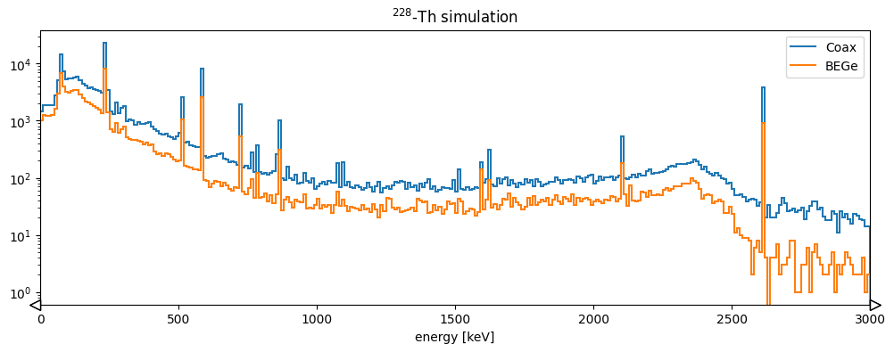

# Full post-processing chain with config files

The previous tutorial showed how to perform a basic post-processing with a Python
script using _reboost_ tools. This is effective for small files, however it has
some limitations.

- need to constantly modify source code,
- memory issues for large files,
- no handling of parameters changing for different detectors.

An alternative approach to handle this is to use configuration files. This is
very similar to how the `pygama` and `dspeed` data processing software works.
For example see [the _dspeed_ tutorial](https://dspeed.readthedocs.io/en/stable/notebooks/IntroToDSP.html#Introduction-to-Digital-Signal-Processing).

The processing from a config file follows all the same steps as from the
previous tutorial. However, it is generalised to allow larger scale processing.
This tutorial describes only the `hit` tier processing (i.e. extraction of
information relating to a single detector channel). Building "events", which
combine information from multiple detectors, is handelled in the next tutorial.

We will process the same data as last time, but for both germanium detectors
and also the liquid argon table!

## Setup the environment

```python
from matplotlib import pyplot as plt
from lgdo import lh5
import hist
import dbetto
import colorlog
import logging
import json

from reboost.build_hit import build_hit
from reboost.build_glm import build_glm

# setup logging
handler = colorlog.StreamHandler()
handler.setFormatter(
    colorlog.ColoredFormatter("%(log_color)s%(name)s [%(levelname)s] %(message)s")
)
logger = logging.getLogger()
logger.handlers.clear()
logger.addHandler(handler)
logger.setLevel(logging.INFO)
```

## Efficient iteration - the GLM

As explained in the [user manual](../manual/iteration.md) the _remage_ output
files (currently) consist of a flat table of steps in sensitive detectors, i.e.
every step is one row. This introduces a challenge in iterating over these
files.

To solve this we store an object on disk called the "Geant4 event lookup map"
(GLM), created through {func}`~.build_glm.build_glm`.

:::{note}
Future versions of _remage_ will likely switch the generation of the GLM into the
remage _itself_.
:::

```python
build_glm(stp_files="stp_out.lh5", glm_files="glm_out.lh5", id_name="evtid")
```

## The config file

We are now almost ready to start our post-processing. However, we need some
configuration files to describe the post-processing we want to perform.

In principle, only a single file is needed [[docs]](../manual/config.md). However,
the generalised approach of the _reboost_ processing means other files can be
used, for example to supply parameters. There is also the possibility to supply
some additional arguments, this is split from the main configuration file since
it is intended for parameters changing more often. For example the path to the
inputs on a given system.

The config file can be supplied as a YAML, JSON file or a python dictionary. We
take the latter approach.

```yaml
config:
  objects:
    geometry: pyg4ometry.gdml.Reader(ARGS.gdml).getRegistry()
    user_pars: dbetto.AttrsDict(dbetto.utils.load_dict(ARGS.pars))

  processing_groups:
    - name: geds # processing for Germanium detectors
      detector_mapping:
        - output:
            - det001
            - det002
      detector_objects: # define objects useful for post-processing
        name: pygeomtools.detectors.get_sensvol_by_uid(OBJECTS.geometry,int(DETECTOR[3:]))[0]
        meta: dbetto.AttrsDict(pygeomtools.get_sensvol_metadata(OBJECTS.geometry, DETECTOR_OBJECTS.name))
        pyobj: legendhpges.make_hpge(pygeomtools.get_sensvol_metadata(OBJECTS.geometry,DETECTOR_OBJECTS.name), registry = None)
        phyvol: OBJECTS.geometry.physicalVolumeDict[DETECTOR_OBJECTS.name]
        det_pars: OBJECTS.user_pars[DETECTOR]
      outputs:
        - t0
        - first_evtid
        - truth_energy
        - active_energy
        - smeared_energy
        - r90
      hit_table_layout: reboost.shape.group.group_by_time(STEPS, window = 10)
      operations:
        t0: ak.fill_none(ak.firsts(HITS.time, axis=-1), np.nan)
        first_evtid: ak.fill_none(ak.firsts(HITS.evtid, axis=-1), np.nan)
        truth_energy: ak.sum(HITS.edep, axis=-1)
        distance_to_nplus: reboost.hpge.surface.distance_to_surface(HITS.xloc, HITS.yloc, HITS.zloc, DETECTOR_OBJECTS.pyobj, DETECTOR_OBJECTS.phyvol.position.eval(), surface_type='nplus')
        activeness: reboost.math.functions.piecewise_linear_activeness(HITS.distance_to_nplus,fccd=DETECTOR_OBJECTS.det_pars.fccd_in_mm, dlf=DETECTOR_OBJECTS.det_pars.dlf)
        active_energy: ak.sum(HITS.edep*HITS.activeness, axis=-1)
        smeared_energy: reboost.math.stats.gaussian_sample(HITS.active_energy,DETECTOR_OBJECTS.det_pars.reso_fwhm_in_keV/2.355)
        r90: reboost.hpge.psd.r90(HITS.edep,HITS.xloc*1000,HITS.yloc*1000,HITS.zloc*1000)

    - name: LAr # processing of hits in the LAr volume
      detector_mapping:
        - output: det003
      outputs:
        - t0
        - first_evtid
        - energy
      hit_table_layout: reboost.shape.group.group_by_time(STEPS, window = 10)
      operations:
        t0: ak.fill_none(ak.firsts(HITS.time, axis=-1), np.nan)
        first_evtid: ak.fill_none(ak.firsts(HITS.evtid, axis=-1), np.nan)
        energy: ak.sum(HITS.edep, axis=-1)
```

Let's go through the config to understand the various blocks, most of these
steps should be very familiar from the previous tutorial.

### Args

The _reboost_ config can depend on an arbitrary set of arguments, for example
this functionality is used to pass paths to the GDML file or to any other file.
These arguments should be contained in a dictionary referred to as `ARGS`, this
is passed to {func}`~.build_hit.build_hit`. We convert this dictionary to a
{class}`dbetto.AttrsDict` so you can reference keys as attributes, this feature
is used to simplify syntax throughout the reboost config.

For example, we can use this feature to pass the path to our GDML file and a
user supplied database of parameters.

```python
args = {"gdml": "geometry.gdml", "pars": "pars.yaml"}
```

We should also create these parameters.

:::{note}

- In a realistic post-processing these could be outputs from detector
  characterisation, data production etc.
- This syntax is fully generic, allowing to pass any arguments (eg. path to
  `LegendMetadata` etc.)
  :::

```{code-block} yaml
:caption: pars.yaml

det001:
  reso_fwhm_in_keV: 0.8
  fccd_in_mm: 1.05
  dlf: 0.4

det002:
  reso_fwhm_in_keV: 1.2
  fccd_in_mm: 2.05
  dlf: 0.8
```

### Global objects

The first section of our config involves the extraction of "global objects".
These are any python objects useful for the full post-processing chain.

:::{note}
This step is fully general, the user is free to extract any object useful for
their post-processing.
:::

```yaml
objects:
  geometry: pyg4ometry.gdml.Reader(ARGS.gdml).getRegistry()
  user_pars: dbetto.AttrsDict(dbetto.utils.load_dict(ARGS.pars))
```

Here the keys to the dictionary are just python expressions. _reboost_ will
take care of importing all packages and evaluating Python expressions. These
expressions can depend on arguments we will pass to _reboost_, as discussed
above.

### Processing groups

Our config file lets us apply a different post-processing to each detector (or
each LH5 table). We split the processing up into "processing groups", these are
sets of detectors (LH5 tables), which should have the same post-processing
chain. However, each detector may have its own objects or parameters.
For example, this functionality can be used to apply a different processing to
SiPM detectors, or to HPGe detectors of different types. Our config
specifies a list of processing groups, which should each have a name:

```yaml
processing_groups
  - name: geds
```

### Detector mapping

Next we need to define our list of detectors to process. However, in general it
is not sufficient to provide a list but we also need to specify the mapping
from the input to the output detector table. An example where this is needed is
for the SiPM channels, where the input is the LAr volume but the output is an
individual SiPM.

The `detector_mapping` key allows us to do this in a generic way, our example
shows the simplest case:

```yaml
detector_mapping:
  - output:
      - det001
      - det002
```

Here we specified a list of output detector names, since we did not define the
"input" detector names, they will be taken as the same as the output.

Other options:

- specify a single detector, for example: `output: [det001]`
- provide an expression evaluating to a list of detectors, for example:
  `output: "[f"det{i:03d}" for i in range(99)]"`
- specify also an input table (if different), for example:

  ```yaml
  detector_mapping:
    - output:
        - sipm_001
        - sipm_002
      input: LAr
  ```

### Detector objects

Similar to the "global objects" defined earlier it is often useless to have
some objects related to one particular detector. This functionality could be
useful to extract:

- the description of the detector geometry,
- parameters for a given detector,
- mappings of certain quantities (eg. drift time).

The syntax is identical to the "objects" key above, we specify a dictionary of
python expressions to evaluate. For example:

```yaml
detector_objects:
  name: pygeomtools.detectors.get_sensvol_by_uid(OBJECTS.geometry,int(DETECTOR[3:]))[0]
  meta: dbetto.AttrsDict(pygeomtools.get_sensvol_metadata(OBJECTS.geometry, DETECTOR_OBJECTS.name))
  pyobj: legendhpges.make_hpge(pygeomtools.get_sensvol_metadata(OBJECTS.geometry,DETECTOR_OBJECTS.name), registry = None)
  phyvol: OBJECTS.geometry.physicalVolumeDict[DETECTOR_OBJECTS.name]
  det_pars: OBJECTS.user_pars[DETECTOR]
```

again _reboost_ will take care of importing the neccesnecessaryary packages and
evaluating the expressions. These can depend on several special keywords:

- `OBJECTS`: the global objects defined earlier.
- `DETECTOR`: the name of the detector.
- `DETECTOR_OBJECTS`: previously defined detector objects, since this
  dictionary is evaluated sequentially one object can be used in the
  computation of the next. This feature is used with the detector name in the
  example above. This does mean we have to be careful of the ordering of the
  dictionary!

In our example, we extract the name of the detector, its metadata block, a
python object describing its geometry (with some useful methods), the
pyg4ometry physical volume and some parameters.

This section of our processing highlights the benefits of integration of the
post-processing with the rest of the remage and LEGEND python infrastructure
and tools.

### Output fields

We then can specify a list of fields we want in our output file. _reboost_ will
take care of removing un-needed fields (eg. from intermediate steps in the
calculations), from the output files.

```yaml
outputs:
  - t0
  - first_evtid
  - truth_energy
  - active_energy
  - smeared_energy
  - r90
```

### Hit-table layout

As mentioned previously the remage output files (currently) have a flat
structure with every row corresponding to a step. To convert this into a table
oriented by the "hits" in the detector, we perform a step called the "hit-table
layout". This name is chosen since this step defines the shape of the hit
table, while all following processors act on this table without changing its
shape.

Again we have the possibility to evaluate an arbitrary Python expression
performing this step, as mentioned in the previous tutorial currently two
functions are implemented in _reboost_ ({mod}`.shape.group`). However, the
user is free to implement their own function, or use something else!

The config block just provides the expression to evaluate:

```yaml
hit_table_layout: reboost.shape.group.group_by_time(STEPS, window=10)
```

here `STEPS` is an alias for the input stp table from _remage_.

### Processors

Now finally we get to the interesting part of the processing chain! Computing
post-processed quantities.. This is handled by the block called "operations".
Our example is below:

```yaml
operations:
  t0: ak.fill_none(ak.firsts(HITS.time, axis=-1), np.nan)
  first_evtid: ak.fill_none(ak.firsts(HITS.evtid, axis=-1), np.nan)
  truth_energy: ak.sum(HITS.edep, axis=-1)
  distance_to_nplus: reboost.hpge.surface.distance_to_surface(HITS.xloc, HITS.yloc, HITS.zloc, DETECTOR_OBJECTS.pyobj, DETECTOR_OBJECTS.phyvol.position.eval(), surface_type='nplus')
  activeness: reboost.math.functions.piecewise_linear_activeness(HITS.distance_to_nplus,fccd=DETECTOR_OBJECTS.det_pars.fccd_in_mm, dlf=DETECTOR_OBJECTS.det_pars.dlf)
  active_energy: ak.sum(HITS.edep*HITS.activeness, axis=-1)
  smeared_energy: reboost.math.stats.gaussian_sample(HITS.active_energy,DETECTOR_OBJECTS.det_pars.reso_fwhm_in_keV/2.355)
  r90: reboost.hpge.psd.r90(HITS.edep,hits.xloc*1000,HITS.yloc*1000,HITS.zloc*1000)
```

Each key gives a field to compute and a Python expression to evaluate. These
can either be _reboost_ functions, or functions from another package. The only
requirement is on the output type (as described in the
[manual](../manual/processors.md). The processors can reference:

- `OBJECTS`: the global objects,
- `DETECTOR_OBJECTS`: the detector objects,
- `HITS`: the table of hits after "hit-table-layout", which will be constantly updated

Every expression is evaluated and a new column is added to the `HITS` table,
this allows us to chain together processors, this is used in a number of places
in the processing chain. Our example:

- extracts the first time of each hit and the event id,
- computes the total energy (before dead-layer correction),
- computes the distance of steps to the n+ surface, the activeness and then the corrected energy,
- smears this with a Gaussian energy resolution,
- computes the `r90` PSD heuristic.

In our config file, these blocks are repeated for the LAr table, you will see the steps repeated.

## Running the post-processing

Now (at last) we are ready to run the post-processing. This is done with
{func}`~.build_hit.build_hit`.

There are many options to this function, for example selecting just some
events, changing the buffers etc. For now we just process the full file.

```python
build_hit(
    "config.yaml",
    args,
    stp_files="stp_out.lh5",
    glm_files="glm_out.lh5",
    hit_files="hit_out.lh5",
    buffer=int(1e5),
)
```

Output:

```
reboost.core [INFO] Getting global objects with dict_keys(['geometry', 'user_pars']) and {'ARGS': {'gdml': 'geometry.gdml', 'pars': 'pars.json'}}
reboost.build_hit [INFO] ... starting post processing of stp_out.lh5 to hit_out.lh5
reboost.build_hit [INFO] ... starting group geds
reboost.build_hit [INFO] ... processing det001 (to ['det001'])
reboost.build_hit [INFO] ... processing det002 (to ['det002'])
reboost.build_hit [INFO] ... starting group LAr
reboost.build_hit [INFO] ... processing det003 (to ['det003'])
reboost.build_hit [INFO]
Reboost post processing took:
 - global_objects        :     3.6 s
 - geds:
   - detector_objects    :     0.4 s
   - read:
     - glm               :     0.1 s
     - stp               :     2.4 s
   - hit_layout          :     0.6 s
   - expressions:
     - t0                :   < 0.1 s
     - first_evtid       :   < 0.1 s
     - truth_energy      :   < 0.1 s
     - distance_to_nplus :     3.8 s
     - activeness        :     0.3 s
     - active_energy     :     0.1 s
     - smeared_energy    :   < 0.1 s
     - r90               :     2.4 s
   - write               :     0.3 s
 - LAr:
   - detector_objects    :   < 0.1 s
   - read:
     - glm               :     0.1 s
     - stp               :    34.6 s
   - hit_layout          :     7.7 s
   - expressions:
     - t0                :     0.2 s
     - first_evtid       :     0.2 s
     - energy            :     0.3 s
   - write               :     0.7 s
```

We see `build_hit` also gives us information on the speed of the various steps
of the processing!

Now we have generated a "hit" tier file that can be used for further analysis.
You can look at the file structure with:

```python
lh5.show("hit_out.lh5")
```

You can read this data with LGDO and then try making the plots from the
previous section (or others). As an example lets try comparing the energy
spectra for the two detectors.

```python
hits_det001 = lh5.read("det001/hit", "hit_out.lh5")
hits_det002 = lh5.read("det002/hit", "hit_out.lh5")

fig, ax = plt.subplots(figsize=(12, 4))
h1 = (
    hist.new.Reg(300, 0, 3000, name="energy [keV]")
    .Double()
    .fill(hits_det001.smeared_energy)
)
h2 = (
    hist.new.Reg(300, 0, 3000, name="energy [keV]")
    .Double()
    .fill(hits_det002.smeared_energy)
)

ax.set_title("$^{228}$-Th simulation")
h2.plot(yerr=False, fill=False, alpha=1, label="Coax")
h1.plot(yerr=False, fill=False, alpha=1, label="BEGe")

ax.set_xlim(0, 3000)
ax.legend()
ax.set_yscale("log")
```


